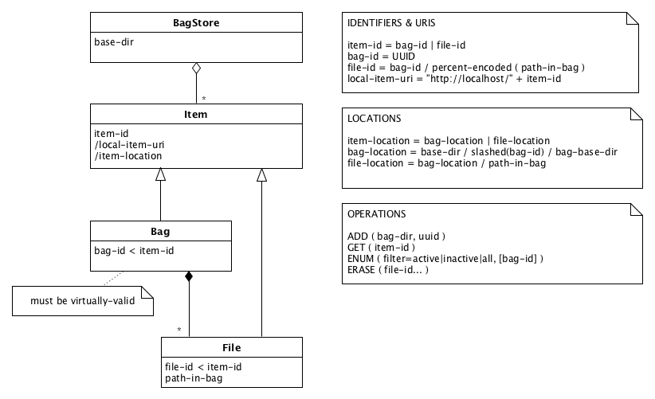

The bag store
=============

Introduction
------------

A bag store is a way to store and identify data packages following a few very simple rules. In this
quasi formal definition we will use CamelCase for classes and lowercase-with-dashes for attributes of
those classes.
 
(See [tutorial] for a more hands-on introduction.)

Structure
---------
1. **DEFINITION**: a **BagStore** is a collection of immutable **Bag**s (see [BagIt]) stored on a 
   hierarchical files system, under a common directory, the **base-dir**.
2. **VIRTUALLY-VALID**: all the the Bags in the BagStore must be **virtually-valid**. A Bag is
   virtually-valid when:
    - it is valid ([as defined by the BagIt specs]), or
    - it is incomplete, but contains a `fetch.txt` file and can be made valid by fetching the files
      listed in it (and removing `fetch.txt` and its checksums from the Bag). If local-item-uris (see
      next point) are used, they must reference Items in the same BagStore.
3. **ITEM-ID:** an **Item** is a Bag or a **File** in a Bag. Each Item has an **item-id**.
    - **bag-id** = `<uuid>`, that is a [UUID]
    - **file-id** = `<bag-id>/percent-encoded(path-in-bag)`, where **percent-encoded** means that the 
      path-components are percent encoded as described in [RFC3986] and **path-in-bag** is the relative
      path of the File in the bag, after `fetch.txt` has been resolved.
    
    Each Item also has a locally resolvable URI (i.e. resolvable in the same BagStore):

    - **local-item-uri** = `http://localhost/<item-id>`

    (Globally resolvable URIs may also be defined for Items. How these are mapped to **item-id**s is
    up to the implementor of the BagStore.)
4. **ITEM-LOCATION:** each Item has a defined **item-location** on the file system:
    - **bag-location** = `<base-dir>/slashed(<uuid>)/[.]<bag-base-dir>`, where **slashed** means that
      the UUID is stripped of hyphens and then subdivided into several groups of characters, with the
      slash as separator. The sizes of the groups of characters must be consistent throughout the
      BagStore. The dot is inserted if the Bag is inactive (see point 5). **bag-base-dir** is the Bag's base directory.
    - **file-location** = `<bag-location>/<path-in-bag>`. If a File is included through the `fetch.txt`
      file, its actual location can be obtained by resolving its URL in `fetch.txt`.
5. **INACTIVE**: a Bag is either **active** or **inactive**. It is inactive if the bag-base-dir is preceded 
   by a dot. It must start off active. The item-ids of a Bag and the Files it contains stay the same whether the Bag is active or inactive. 

[tutorial]: ./tutorial.md
[BagIt]: https://tools.ietf.org/html/draft-kunze-bagit
[as defined by the BagIt specs]: https://tools.ietf.org/html/draft-kunze-bagit#section-3
[UUID]: https://en.wikipedia.org/wiki/Universally_unique_identifier
[RFC3986]: https://tools.ietf.org/html/rfc3986#section-2.1

Operations
----------
On a BagStore the following operations are allowed:

* `ADD` - add a new, virtually-valid Bag to the BagStore.
* `ENUM` - enumerate all the Items in the BagStore or all the items in one Bag.
* `GET` - copy an Item from the BagStore.
* `DEACTIVATE` - mark a Bag as inactive.
* `REACTIVATE` - reverse a deactivation.
* `ERASE` - erase the contents of a particular Bag **payload** File, and update the corresponding 
   entries in any affected payload manifests accordingly. 

The `DEACTIVATE` operation marks a Bag as inactive. This involves marking the Bag directory as hidden 
by prepending its name with a dot. Note that this operation does not require copying or modifying any 
File data. The only "file" that is modified is the directory containing the Bag. On some file systems 
this may still require write-privileges on the bag-base-dir.

The `ERASE` operation is the one exception to the rule that Bags are immutable. It must only be used in cases
where there is a legal obligation to destroy the data. For other use cases there are better solutions:

* To support updates to Bags, add metadata that records that a Bag is part of a sequence of Bags, that together
  form the revision history of one logical (and mutable) Bag. See for an example implementation the
  [easy-bag-index] project.
* To clean up a BagStore that has gathered too much "garbage", do a [Clean-up BagStore] migration.

[easy-bag-index]: https://github.com/DANS-KNAW/easy-bag-index
[Clean-up BagStore]: ./migrations.md#clean-up-bagstore

Schematic summary
-----------------

The following diagram summarizes the structure and operations of a BagStore.

   

Remarks:
* The notation `bag-id < item-id` is intended to mean that a bag-id is a special kind of item-id.
* A slash preceding an attribute signifies that it is derivable from other attributes. (This is actually an existing UML notation.)
* Note that there are at least two Files in a virtually-valid Bag, namely `bagit.txt` and the `data` directory (unless you do not count
  directories as Files, of course, in which case it would be one).
* All Items are ultimately contained in a BagStore, so one could argue that the BagStore should have been pictured to contain Items
  rather than Bags. I have opted to stress the fact that a BagStore only *directly* contains Bags, leaving the fact that Files are 
  indirectly contained in a BagStore implicit.

Technical considerations
------------------------

### Slashing the bag-id

The rationale for this is that some file systems suffer a performance loss when a directory gets overfull. By distributing the
contents of the BagStore over subdirectories this problem is avoided. How deep to make the directory tree depends on the
number of (expected) Bags. However, note that it is relatively easy to change this later on, with a series of move operations.
In most (all?) file systems this means no data needs to be actually copied if the BagStore is contained in a single 
storage volume.