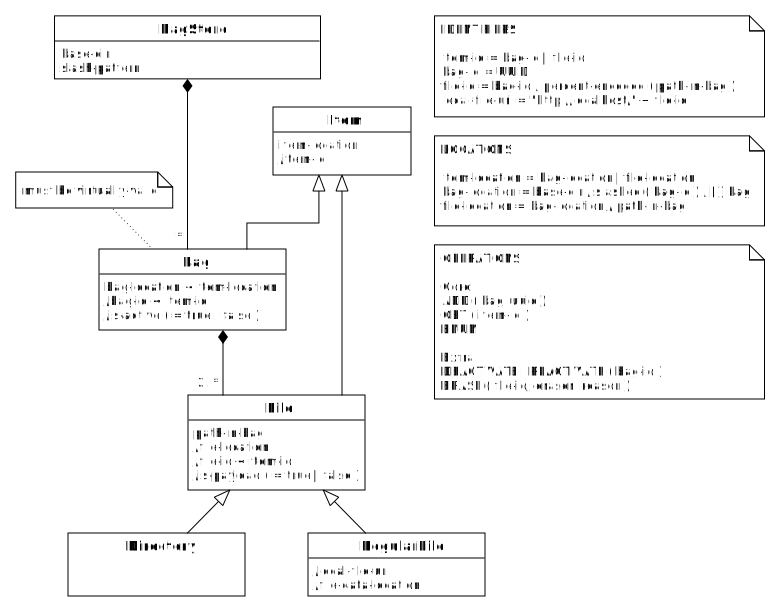

TABLE OF CONTENTS
-----------------

- [Introduction](#introduction)
- [Summary](#summary)
  * [In two sentences](#in-two-sentences)
  * [In one picture](#in-one-picture)
- [Objects & attributes](#objects---attributes)
  * [BagStore](#bagstore)
  * [Bag](#bag)
  * [Item](#item)
- [Operations](#operations)
  * [Core](#core)
  * [Extra](#extra)
- [Migrations](#migrations)
  * [Merge BagStores](#merge-bagstores)
  * [Split BagStore](#split-bagstore)
  * [Change bag-id slashing](#change-bag-id-slashing)
- [Technical considerations](#technical-considerations)
  * [Slashing the bag-id](#slashing-the-bag-id)

Introduction
------------
A bag store is a way to store and identify data packages following a few very simple rules. This 
document intends to describe the bag store in a terse and quasi-formal manner. See the [tutorial] 
for a more elaborate, hands-on introduction.

[tutorial]: 04_tutorial.html

Summary
-------

### In two sentences
A [**BagStore**](#bagstore) is a collection of immutable, **virtually-valid** **Bag**s stored under 
a common **base-dir**. Each **Item** (Bag, **File**, **Directory**) in the BagStore has an 
**item-id**, **item-location** and **local-item-uri** which can easily be mapped onto eachother. 
**TODO: Mention UUID and decentralized minting.**

### In one picture
   

#### Remarks
* The notation `bag-id < item-id` means that a bag-id is a special kind of item-id.
* A slash preceding an attribute signifies that it is derivable from other attributes.

Objects & attributes
--------------------
### BagStore
The collection of Bags stored under a common base directory (**base-dir**). It uses a single slash 
pattern (see [item-location](#item-location)).

### Bag
The elements of the BagStore are Bags, i.e. directories or archive files adhering to the [BagIt] 
specifications. The Bags must be virtually-valid. It may be active or inactive.

#### virtually-valid
A Bag is virtually-valid if:

- it is valid ([as defined by the BagIt specs]), or
- it is incomplete, but contains a [`fetch.txt`] file and can be made valid by fetching the files
  listed in it and removing `fetch.txt` and its corresponding checksums from the Bag (**is dat nodig?**). If [local-item-uris](#local-item-uri) 
  are used, they must reference Items in the same BagStore.
  
#### (in)active  
A Bag in a BagStore is inactive if it has a hidden attribute in the file system, or if its name starts with a full stop character
(which on some file systems is the same thing). It is active otherwise. The BagStore may support transitioning a Bag between active and
inactive, as an exception to the immutability property.
  
### Item
An **Item** is a Bag, or a **File** in a Bag. Each Item has an **item-id**. A **Directory** is considered a 
special case of File.

#### item-id
The item-ids are defined as follows:

- **bag-id** = `<uuid>`, that is a [UUID]. 
- **file-id** = `<bag-id>/percent-encoded(path-in-bag)`, where **percent-encoded** means that the 
  path-components are percent encoded as described in [RFC3986] and **path-in-bag** is the relative
  path of the File in the bag, after `fetch.txt` has been resolved.
  
#### local-item-uri

**<a id="local-item-uri" />local-item-uri** = `http://localhost/<item-id>`
 

#### item-location
The item-locations are defined as follows:

- **bag-location** = `<base-dir>/slashed(<uuid>)/[.]<bag>`, where **slashed** means that
  the UUID is stripped of hyphens and then subdivided into several groups of characters, with the
  slash as separator. The sizes of the groups of characters must be consistent throughout the
  BagStore. The dot is inserted if the Bag is inactive (see point 5). **bag** is the Bag's base directory,
  in the case of an unserialized bag, or the filename of the [serialization].
- **file-location** = `<bag-location>/<path-in-bag>`. If a File is included through the `fetch.txt`
  file, its actual location can be obtained by resolving its URL in `fetch.txt`.

[BagIt]: https://tools.ietf.org/html/draft-kunze-bagit
[as defined by the BagIt specs]: https://tools.ietf.org/html/draft-kunze-bagit#section-3
[serialization]: https://tools.ietf.org/html/draft-kunze-bagit#section-4
[UUID]: https://en.wikipedia.org/wiki/Universally_unique_identifier
[RFC3986]: https://tools.ietf.org/html/rfc3986#section-2.1
[`fetch.txt`]: https://tools.ietf.org/html/draft-kunze-bagit#section-2.2.3

Operations
----------
On a BagStore the following operations are allowed. They have been subdivided into two groups. The core
operations must be supported directly, the extra operations *may* only be supported through [Migration]:

### Core
* `ADD` - add a new, virtually-valid Bag to the BagStore.
* `ENUM` - enumerate all the Items in the BagStore or all the items in one Bag.
* `GET` - copy an Item from the BagStore.

Note that this means that Bags are immutable. To support updates to Bags, add metadata that records 
that a Bag is part of a sequence of Bags, that together form the revision history of one logical 
(and mutable) Bag. See for an example implementation the [easy-bag-index] project.

### Extra
* `DEACTIVATE` - mark a Bag as inactive.
* `REACTIVATE` - reverse a deactivation.
* `ERASE` - erase the contents of a particular Bag **payload** File, and update the corresponding 
   entries in any affected payload manifests accordingly. 

The `DEACTIVATE` operation marks a Bag as inactive. This involves marking the Bag directory as hidden 
by prepending its name with a dot. Note that this operation does not require copying or modifying any 
File data. The only "file" that is modified is the directory containing the Bag. On some file systems 
this may still require write-privileges on the bag-base-dir.

The `ERASE` operation is the one exception to the rule that Bags are immutable. It must only be used in cases
where there is a legal obligation to destroy the data. For other use cases there are better solutions:

[easy-bag-index]: https://github.com/DANS-KNAW/easy-bag-index
[Migration]: #migrations

 

Migrations
----------  
A **Migration** is a BagStore-wide transformation. The input of a Migration is always one or more BagStores. The output
may in principle be anything depending on the Migration procedure. Below we will define some Migrations whose outputs are also one or
more BagStores. Migrations are riskier than normal operations and should normally be avoided.

### Merge BagStores
Merging two BagStores can be done in at most two steps:

1. Harmonize the slashing settings of both BagStores. (This can of course be equal to the settings of one of the existing BagStores.)
2. Copy the base-dirs and their contents to the new base-dir. (Again, this can be one of the existing base-dirs.)

If the slashing settings are already equal, this step can be foregone.

### Split BagStore
Splitting a BagStore is a bit more involved, because BagStores must not include files by reference from other BagStores. It is therefore
necessary to determine which bags form a self-contained sub-set:

1. Determine which bags you want to split off.
2. For each bag determine if it has `fetch.txt` that includes Files, add the Bag that actually contains them to the BagStore to be
   split off, recursively.

### Change bag-id slashing
This Migration only changes directory names:

1. From base-dir downwards find the last directory-level that has the desired name-length already. 
2. In each directories at this level:
   
   1. For each bag contained in the directory:

      1. Remove the slashes from the remaining path to the bag
      2. Insert the slashes in the remaining path in the new positions
      3. Move the bag to the location pointed to by the new remaining path.

Technical considerations
------------------------

### Slashing the bag-id

The rationale for this is that some file systems suffer a performance loss when a directory gets overfull. By distributing the
contents of the BagStore over subdirectories this problem is avoided. How deep to make the directory tree depends on the
number of (expected) Bags. However, note that it is relatively easy to change this later on, with a series of move operations.
In most (all?) file systems this means no data needs to be actually copied if the BagStore is contained in a single 
storage volume.