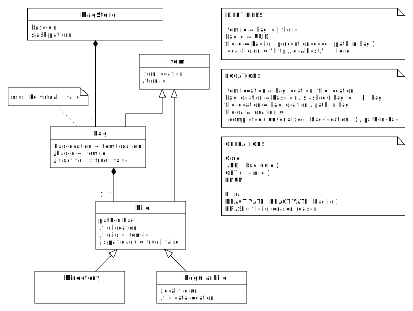

Definitions
===========

Introduction
------------
A bag store is a way to store and identify data packages following a few very simple rules. This 
document describes the bag store concept in a terse and quasi-formal manner. See the [tutorial] 
for a more elaborate, hands-on introduction.

[tutorial]: tutorial.md

Summary
-------

### In two sentences
A [**BagStore**](#bagstore) is a collection of immutable, [**virtually-valid Bag**](#bag)s stored under 
a common [**base-dir**](#bagstore). Each [**Item**](#item) in the BagStore has an [**item-id**](#item-id)
and an [**item-location**](#item-location) with simple mapping rules to translate between them. 

### In one picture
   

#### Remarks
* The notation `bag-id < item-id` means that a bag-id is a special kind of item-id.
* A slash preceding an attribute signifies that it is derivable from other attributes.

Objects & attributes
--------------------
### BagStore
The collection of Bags stored under a common base directory (**base-dir**). It uses a single **slash-pattern**
(see [item-location](#item-location)).

### Bag
The elements of the BagStore are Bags, i.e. directories or archive files conforming to the [BagIt] 
specifications. The Bags must be virtually-valid. They may be active or inactive.

#### virtually-valid
A Bag is virtually-valid if:

- it is [valid], or
- it is incomplete, but contains a [`fetch.txt`] file and can be made valid by fetching the files
  listed in it and removing `fetch.txt` and its corresponding checksums from the Bag. If 
  [local-file-uris](#local-file-uri) are used, they must reference RegularFiles in the same BagStore.
  
#### (in)active  
A Bag in a BagStore is inactive if its name starts with a full stop character. It is active otherwise.

### Item
An **Item** is a Bag, or a **File** in a Bag. A File is either a **RegularFile** or a **Directory**. 
Each Item has an **item-id**. 

#### item-id
The item-ids are defined as follows:

- **bag-id** = `<uuid>`, that is a [UUID] represented as lowercase hexadecimal digits and hyphens, following
  the layout described in [RFC4122].
- **file-id** = `<bag-id>/percent-encoded-segments(<path-in-bag>)`, where:

  - **percent-encoded-segments** means that to each path segment [percent-encoding] is applied to 
    all characters except (English) alphanumericals and the underscore character. When percent-encoding a
    character, the [UTF-8] representation must be used as input.

  - **path-in-bag** is the relative path of the File in the bag, after `fetch.txt` has been resolved.
  
#### item-location
The item-locations are defined as follows:

- **bag-location** = `<base-dir>/slashed(<uuid>)/[.]<bag>`, where:
 
    - **slashed** means that the UUID is stripped of hyphens and then subdivided into several groups 
      of characters, with the slash as separator, forming a file path. The number of slashes to insert 
      and where to insert them is specified by the **slash-pattern**.
  
    - **bag** the name of the Bag. For an unserialized Bag this is the name of the base directory, for a serialized
      Bag the name of the archive file containing it, including the extension, such as `.tar` or `.7z`. The
      base directory of the bag must always be the same as the base name of the serialized bag.
      
    - the **dot**, if present, means that the bag is [inactive](#inactive).
      
- **file-location** = `<bag-location>/<path-in-bag>`.
  
#### file-data-location
The file-data-location is the location where the RegularFile's data is actually stored (in the
case of an unserialized Bag), or where it *would* be stored if a serialized Bag were unserialized and
completed in-place. (Note the conditional, however, as actually performing unserialization and completion
in-place is not permitted.) 

- **file-data-location** = `completed(unserialized(<bag-location>))/path-in-bag`, where:

    - **unserialized** means the Bag after unserializing it in-place.
    - **completed** means the Bag after fetching the Items in `fetch.txt`, if present.
    
Note that a RegularFile that is included through a fetch-reference has **file-data-location** different from its [file-location](#item-location).      
   
#### local-file-uri
For RegularFile we define a local-file-uri. This may, but does not need to be resolvable through a web server.
It is intended to be used in `fetch.txt`, to obviate the need for storing the exact same file multiple times in the same 
BagStore.

 - **local-file-uri** = `http://localhost/<file-id>`

[BagIt]: https://tools.ietf.org/html/draft-kunze-bagit
[valid]: https://tools.ietf.org/html/draft-kunze-bagit#section-3
[UUID]: https://en.wikipedia.org/wiki/Universally_unique_identifier
[RFC4122]: https://tools.ietf.org/html/rfc4122#section-3
[percent-encoding]: https://tools.ietf.org/html/rfc3986#section-2.1
[UTF-8]: https://tools.ietf.org/html/rfc3629
[`fetch.txt`]: https://tools.ietf.org/html/draft-kunze-bagit#section-2.2.3

Operations
----------
On a BagStore the following operations are allowed.

* `ADD` - add a virtually-valid Bag to the BagStore.
* `ENUM` - enumerate all the Bags in the BagStore.
* `GET` - copy a Bag or an non-packaged RegularFile from the BagStore.
* `DEACTIVATE` - mark a Bag as inactive.
* `REACTIVATE` - reverse a deactivation.

Note that this means that Bags are immutable. To support updates to Bags, add metadata that records
that a Bag is part of a sequence of Bags, that together form the revision history of one logical 
(and mutable) Bag. See for an example implementation the [easy-bag-index] project.

The `DEACTIVATE` operation marks a Bag as inactive. This involves marking the Bag directory as hidden
by prepending its name with a dot. Note that this operation does not require copying or modifying any
File data. The only "file" that is modified is the directory containing the Bag. On some file systems
this may still require write-privileges on the bag-base-dir.

### Extension
Some use cases may require bag data to be deleted, for example for legal reasons. For those special cases, an
extra operation is defined:

* `ERASE` (optional) - erase the contents of a particular Bag **payload** File, and update the corresponding
  entries in any affected payload manifests accordingly.

[easy-bag-index]: https://github.com/DANS-KNAW/easy-bag-index
[Migration]: #migrations
[core]: #core
[extra]: #extra

Compatibility with Archival Resource Keys
-----------------------------------------
Although item-ids are not Archival Resource Keys ([ARK]s) by themselves, they can be used to mint ones. All that is
needed is an ARK "Name Assigning Authority Number" (NAAN). Optionally, a "Name Mapping Authority Hostport" (NMAH) can 
be provided to resolve ARKs over http. 

### Minting an ARK using an item-id
An ARK has the following general form:

    [http://NMAH/]ark:/NAAN/Name[Qualifier]

To mint your ARK you need to do the following substitutions in this template:

* Your NAAN for the string `NAAN`.
* If you want to instantiate the optional NMAH-prefix: your NMAH for the string `NMAH`.
* The item-id for the string `Name[Qualifier]`. 
  * The `bag-id` part of the item-id fulfills the role of `Name`.
  * if the Item is a File, then te part `/percent-encoded-segments(<path-in-bag>)` fulfills the role of `Qualifier`.

Note that the definition of [`percent-encoded-segments`](#item-id) ensures that the resulting string is a syntactically valid ARK and that it 
can be used without problems as part of an HTTP URL. The characters that can appear unencoded (the alphanumericals and underscore):
 
 * all are part of the ARK character repertoire and (except `/`) have no special semantics in ARK;
 * the `/` is used as a hierarchical delimiter, and therefore has the semantics required by ARK;
 * all are member of the set of [URI unreserved characters] and thus have no special semantics in a URI.

### Getting an item-id from an ARK
The ARKs you have minted as described above, you can easily convert back to item-ids.

1. Normalize the ARK following the procedure described in section "2.7 Normalization and Lexical Equivalence" of the 
   [ARK] specification.
2. Insert hyphens in the UUID part so that it conforms to the canonical textual representation of a UUID.

With the item-id you can then calculate the item-location to retrieve the actual data.
 
[ARK]: http://n2t.net/e/arkspec.txt
[URI reserved characters]: https://tools.ietf.org/html/rfc3986#section-2.2
[URI unreserved characters]: https://tools.ietf.org/html/rfc3986#section-2.3

Technical considerations
------------------------

### Slashing the bag-id

The rationale for this is that some file systems suffer a performance loss when a directory gets overfull. By distributing the
contents of the BagStore over subdirectories this problem is avoided. How deep to make the directory tree depends on the
number of (expected) Bags. However, note that it is relatively easy to change this later on, with a series of move operations.
In most (all?) file systems this means no data needs to be actually copied if the BagStore is contained in a single 
storage volume.
